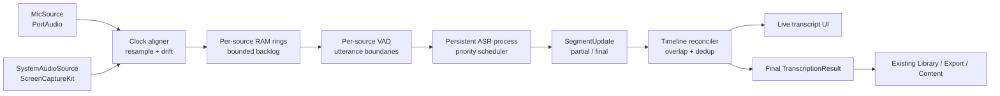

# Whispered Live: публичный план развития

> Версия: 18 июля 2026. Статус: в разработке; L1–L10 реализованы на уровне кода и unit-тестов, L4–L10 требуют ручной приёмки; live-флаг выключен.
> Назначение: довести Whispered до законченного live-продукта для локальной
> транскрипции онлайн-встреч, семинаров и эфиров, сохранив существующий batch-
> конвейер без изменений.

## 0. Место в общей дорожной карте Whispered

Этот документ не заменяет `ROADMAP.md`: он подробно описывает новый Live-
трек. Для состояния «законченный публичный Whispered» порядок такой:

1. закрыть текущий public focus из `ROADMAP.md` — надёжность локальной LLM и
   недопущение сохранения failed artifacts;
2. выполнить L1–L26 этого документа;
3. пройти общий batch + live release gate и опубликовать install artifact.

После этого Whispered остаётся самостоятельным продуктом: batch-конвейер
«файл → контент» плюс live-конвейер «онлайн-встреча → транскрипт → тот же
контент». Будущие предметные продукты могут переиспользовать его публичные
контракты, но их логика и roadmap не являются частью этого репозитория.

## 1. Итоговый пользовательский сценарий

Пользователь открывает раздел **Live**, выбирает источник и нажимает Start:

- микрофон;
- системный звук конкретного приложения/встречи;
- микрофон + системный звук одновременно.

Whispered показывает живой локальный транскрипт, различает локального и
удалённого говорящего по источнику, не блокирует интерфейс и не теряет аудио
при временной нагрузке. После Stop результат становится обычной записью
Whispered: его можно исправить, переименовать спикеров, экспортировать и
передать в уже существующий content pipeline.

Основной macOS-сценарий — Zoom, Google Meet и Microsoft Teams. Live core
остаётся переносимым; на Linux первая реализация может поддерживать только
микрофон до появления отдельного system-audio adapter.

Scope этого roadmap заканчивается на живом транскрипте и передаче результата
в уже существующую пост-обработку Whispered.

## 2. Нерушимые архитектурные границы

1. Существующий batch-путь и `_run_transcription_process` не рефакторятся
   ради live-режима.
2. Финальный live-фрагмент — существующий
   `Segment(start, end, text, speaker, words)`.
3. Изменяемый хвост живёт во внешней оболочке
   `SegmentUpdate(segment_id, revision, state, segment)` и недоступен старым
   потребителям.
4. После Stop финальные segments образуют обычный `TranscriptionResult`.
5. Audio callback только нумерует и кладёт PCM frames в bounded queue. VAD,
   resampling, ASR и запись выполняются вне UI thread.
6. ASR-модель загружается один раз в отдельном отменяемом процессе.
7. Все новые функции находятся за feature flag до standalone-гейта.
8. Live работает полностью локально. Облачная обработка не является частью
   live pipeline.

## 3. Архитектурный эскиз

### 3.1. Источники аудио

**Микрофон:** использовать существующий `sounddevice` через новый
`AudioSource` adapter. Нельзя переписывать старый recorder в первом шаге:
adapter должен сохранить прежнюю запись WAV и meter.

**Системный звук macOS:** ScreenCaptureKit. Реализационные кандидаты:

| Вариант | Плюсы | Минусы | Решение |
|---|---|---|---|
| Небольшой Swift capture-helper + локальный Unix socket/pipe | Нативный API, изоляция от Python, helper можно жёстко завершить | Xcode build, подпись helper, IPC protocol | **Основной кандидат** после одновечернего спайка |
| PyObjC binding к ScreenCaptureKit | Меньше отдельных бинарников | Тяжёлые Python/macOS bindings, риск PyInstaller и callback lifecycle | Challenger в спайке |
| Виртуальный loopback driver | Работает с разными приложениями | Требует стороннюю установку и routing, плохой onboarding | Не делать обязательной зависимостью |

Helper передаёт только timestamped PCM; он ничего не знает о UI, ASR или
сохранении. Приложение должно уметь выбрать конкретное приложение/окно и не
захватывать собственный playback Whispered.

### 3.2. Синхронизация двух источников

Mic и system audio могут иметь разные sample rate и clocks. `ClockAligner`:

- переводит оба потока в 16 кГц mono float/int16;
- сохраняет original source timestamp и общий monotonic timestamp;
- измеряет drift и корректирует его небольшим resampling, а не вставкой
  больших разрывов;
- не смешивает каналы до ASR: каждый источник остаётся отдельным;
- обозначает discontinuity при смене устройства или потере frames.

Раздельность даёт speaker labels без ML:

- `Microphone` — локальный участник;
- `Meeting audio` — удалённый участник;
- пользователь может переименовать обоих после Stop.

Если одна фраза попала в оба источника из-за monitoring/echo, reconciler
должен найти временно-текстовый дубль и оставить одну реплику с флагом
неоднозначности. При трёх и более удалённых участниках system audio остаётся
общим mix; их индивидуальное разделение не входит в MVP.

### 3.3. VAD

Рекомендуемый основной вариант — отдельный Silero VAD через ONNX: он не
привязан к ASR-движку и работает на каждом source независимо. WebRTC VAD —
лёгкий fallback. Встроенный Silero whisper.cpp можно проверить, но не делать
границей системы.

Стартовые параметры для спайка:

- frames 30–100 мс;
- pre-roll 150–250 мс;
- конец utterance после 500–800 мс тишины;
- post-roll около 200 мс;
- длинная речь делится на 12–15 сек в ближайшей паузе;
- короткие подтверждения не отбрасываются только по длительности.

### 3.4. Streaming ASR

Основной движок — уже используемый whisper.cpp:

- одна постоянно загруженная модель в дочернем процессе;
- raw NumPy/PCM вместо временных WAV;
- rolling decode каждые 1,5–2 сек и/или по VAD endpoint;
- окно 6–10 сек с перекрытием 0,8–1,5 сек;
- partial tail может меняться;
- final определяется stable-prefix в двух декодах либо VAD timeout;
- идентичность сегмента определяется временем/source/revision, не строкой.

Два source не должны запускать две тяжёлые модели. Один scheduler обслуживает
очереди справедливо, отдавая приоритет источнику с большим lag. Если машина не
успевает, сначала уменьшается частота partial-декодов; final utterances и
audio backlog сохраняются.

Parakeet TDT остаётся challenger за интерфейсом `StreamingASREngine`, но не
блокирует релиз. faster-whisper не является основным вариантом для Apple
Silicon, поскольку его поддержанный GPU-путь ориентирован на CUDA.

### 3.5. Timeline и существующий Segment

Одновременная речь создаёт перекрывающиеся по времени segments. Поэтому новый
timeline reconciler обязан:

- хранить стабильный `segment_id` и revision;
- сортировать по start time, не уничтожая overlap;
- не склеивать разные sources в одну реплику;
- удалять только доказанный echo duplicate;
- финализировать старый `Segment` без новых обязательных полей;
- иметь отдельную export-policy для пересекающихся SRT/VTT cues;
- перед передачей в старые LLM-промпты строить читаемые source-labelled
  блоки, не меняя сам content pipeline.

## 4. Цели качества

### 4.1. Latency SLO

| Метрика | Target p95 |
|---|---:|
| Audio callback → RAM queue | ≤100 мс |
| VAD endpoint | 0,5–0,8 сек после паузы |
| Partial transcript | ≤3 сек позади речи |
| Final segment | ≤5 сек после конца реплики |
| Stop capture/helper | ≤2 сек |
| Отображение уже готового Segment | ≤100 мс |

### 4.2. Resource profiles

**Минимум: Apple Silicon 16 ГБ.** Whisper turbo Q5 либо меньшая модель,
один ASR process, два небольших audio rings. Live transcript обязан работать;
частота partial может быть ниже.

**Рекомендуется: 24 ГБ.** Whisper turbo Q5/Q8, более частые partial updates и
запас для обычных приложений встречи.

Приложение заранее показывает профиль и проверяет модель, разрешения,
свободную память и доступность источников. Модель не переключается скрыто во
время записи.

### 4.3. Деградация

Приоритет: не потерять audio → получить final transcript → показать partial.

1. Уменьшить частоту partial decode.
2. Увеличить допустимый ASR lag с видимым индикатором.
3. Временно показывать только finalized utterances.
4. Если system source потерян, продолжать mic и явно показать потерю канала.
5. Никогда не создавать скрытый temp-файл только ради маскировки перегрузки.

Технические метрики не содержат текста: queue depth, dropped frames, p50/p95
decode latency, revision count, RSS, source disconnects, helper restarts.

## 5. Исследовательские спайки: каждый ≤ одного вечера

| # | Спайк | Критерий успеха |
|---|---|---|
| S1 | Swift helper против PyObjC: 10 минут system audio | Стабильный PCM + timestamps, Stop ≤2 сек, понятный путь упаковки; выбран один вариант |
| S2 | Zoom, Google Meet, Teams: mic + system по 10 минут | Оба голоса присутствуют в правильных sources; echo/duplicates и permission UX измерены |
| S3 | Clock drift двух sources за 60 минут | Расхождение после коррекции <100 мс; нет слышимых/текстовых разрывов |
| S4 | Silero против WebRTC на сохранённых online samples | Не режет края >200 мс; короткие ответы сохранены; CPU не влияет на ASR |
| S5 | Persistent whisper.cpp на 10-минутном gold-наборе | Partial p95 ≤3 сек, final p95 ≤5 сек, duplicates = 0, WER не хуже batch более чем на 2 п.п. |
| S6 | Один ASR scheduler, два одновременных source | 30 минут playback 1x, 0 dropped frames, оба source final p95 ≤5 сек |
| S7 | Echo/dedup на намеренно продублированном голосе | 0 ложных удалений разных реплик; ≥95% искусственных дублей помечены/удалены |
| S8 | 16 ГБ и 24 ГБ resource soak | 60 минут, встреча продолжает работать, memory pressure не красный, 0 audio drops |
| S9 | Standalone `.app`: permissions/helper/spawn | Работает без IDE; повторный Start не создаёт второе окно; подпись/сборка воспроизводимы |

S1–S3 блокируют dual-source capture. S4–S6 блокируют live transcript. S8–S9
блокируют публичный релиз.

## 6. Инкрементальный backlog

Каждый пункт — отдельная задача агенту и отдельный commit.

### Этап A. Контракты и один источник

| ID | Результат | Вечерняя приёмка без чтения кода |
|---|---|---|
| L1 | Baseline: batch-smoke, golden `Segment/TranscriptionResult`, 10-минутный audio fixture и метрики | Обычный файл даёт прежний transcript/export; весь старый suite зелёный |
| L2 | `AudioFrame`, `SpeechTurn`, `SegmentUpdate` и state machine на симуляторе | В demo partial меняется, final больше не меняется; результат — обычные `Segment` |
| L3 | `MicSource` adapter поверх существующего recorder (`core/live/mic_source.py`) | Старые Record/Pause/Resume/Stop и WAV работают; новый meter/frames включаются feature flag |
| L4 | Bounded RAM ring, monotonic timestamps, lag/drops, cancellation (`core/live/audio_buffer.py`) | 30 минут без роста памяти; искусственное торможение видно, UI не зависает |
| L5 | Per-source VAD (`core/live/vad.py`) | Десять фраз и короткие ответы не обрезаны; музыка не создаёт бесконечный utterance |
| L6 | Persistent whisper worker для mic (`core/live/asr_worker.py`) | Модель грузится один раз; 15 минут live; Cancel ≤2 сек; final p95 измерен |
| L7 | Stable-prefix/revisions/dedup одного source (`core/live/reconciler.py`) | Черновой хвост видим; после паузы не прыгает; повторяющаяся фраза не дублируется |

**Гейт A:** 30 минут mic-only, 0 drops, final p95 ≤5 сек, WER в пределах
+2 п.п. от batch, Cancel ≤2 сек, старый batch полностью зелёный.

### 6.1. Точка продолжения в текущей ветке

- **L1–L2** — контракты и golden batch baseline уже находятся в истории.
- **L3** — добавлен `MicSource` adapter поверх `core.recorder.Recorder`.
  Legacy recorder получает только необязательный non-blocking `frame_sink`;
  при выключенном live-флаге sink не устанавливается. Fake-device тесты
  покрывают Start/Pause/Resume/Stop, meter, frames и Cancel; ручной прогон с
  реальным микрофоном остаётся частью приёмки L3.
- **L4** — добавлен независимый `BoundedAudioRing` с ограничением по кадрам и
  байтам, `MonotonicTimestamp`, `CancellationToken` и `RingStats`. При
  вытеснении backlog следующий кадр получает `discontinuity=True`; callback
  никогда не ждёт потребителя. Полный 30-минутный ручной/интеграционный soak
  остаётся частью приёмки L4.
- **L5** — добавлен `PerSourceVAD` с dependency-free energy backend,
  hysteresis, pre-roll 200 мс, post-roll 200 мс, endpoint после 600 мс тишины
  и split длинных utterances по 15 сек. Backend заменяемый, поэтому Silero или
  WebRTC можно подключить без изменения `SpeechTurn`; ручной набор из десяти
  фраз и музыкальный sample остаются частью приёмки L5.
- **L6** — добавлен `PersistentWhisperWorker`: child process загружает модель
  один раз, принимает raw PCM VAD turns, поддерживает `abort_callback` и
  возвращает обычные `transcriber.Segment` в parent. Metrics считают
  end-to-end final latency и p95; ручной 15-минутный live прогон с реальной
  моделью и проверка Cancel ≤2 сек остаются частью приёмки L6.
- **L7** — добавлен `LiveSegmentReconciler`: stable-prefix tracker,
  стабильные IDs `source:turn:index`, monotonic revisions, terminal final и
  dedup только при совпадении нормализованного текста и temporal overlap.
  Разные повторения без overlap сохраняются; ручной live-паузный сценарий
  остаётся частью приёмки L7.
- **L8** — выбран Swift ScreenCaptureKit helper с локальным Unix socket и
  добавлен versioned contract `whispered.system-audio` v1: framed JSON control
  messages + binary s16le PCM, fragmented-read decoder и lifecycle, запрещающий
  audio после `stopped`. Реальный helper spike, permissions, meter и
  освобождение `SCStream` остаются ручной приёмкой L8/S1.
- **L9** — добавлен Python `SystemAudioSource` поверх L8 contract: async
  helper connection, hello/start/started handshake, per-source bounded ring,
  helper meter, monotonic timestamp validation, permission-denial message и
  graceful Stop/Cancel. Реальный 15-минутный YouTube/Meet прогон возможен
  после появления Swift helper и остаётся ручной приёмкой L9.
- **L10** — добавлены `SourceClockAligner` и `DualSourceClockAligner`: mono
  PCM приводится к 16 кГц, correction ограничен по ppm, initial offset не
  считается drift, а report показывает source/monotonic/corrected drift и
  target status. Synthetic 60-секундный dual-source прогон покрывает малый и
  большой drift; 60-минутный реальный soak остаётся ручной приёмкой L10.

### Этап B. Системный звук и два источника

| ID | Результат | Вечерняя приёмка без чтения кода |
|---|---|---|
| L8 | Выбранная архитектура system capture и документированный IPC contract (`docs/SYSTEM_CAPTURE_IPC.ru.md`) | Запустить spike build, выбрать приложение, увидеть system meter, Stop освободил capture |
| L9 | SystemAudioSource в приложении (`core/live/system_audio_source.py`) | 15 минут YouTube/Meet транскрибируются без микрофона; permission denial понятен |
| L10 | SourceClockAligner + resampling/drift metrics (`core/live/clock_aligner.py`) | Два source идут на одной timeline 60 минут; отчёт drift <100 мс |
| L11 | Двухочередный ASR scheduler | Одновременная речь обоих source появляется без голодания одного канала |
| L12 | Source speaker labels и overlap timeline | Mic/Meeting audio визуально различаются; одновременные реплики обе сохранены |
| L13 | Echo/duplicate detector | Контрольный echo не удваивает текст; разные похожие фразы не удаляются |
| L14 | Zoom/Meet/Teams compatibility matrix | По одному 20-минутному прогону: capture, permissions, device switch, echo, Stop; результат сохранён в отчёте |

**Гейт B:** Zoom, Google Meet и Teams проходят 20 минут каждый; оба source
присутствуют, role accuracy ≥98% для non-overlap speech, boundary/echo
duplicates = 0 на эталоне, 0 dropped audio frames.

### Этап C. Законченный пользовательский продукт

| ID | Результат | Вечерняя приёмка без чтения кода |
|---|---|---|
| L15 | Live UI: source picker, meters, elapsed, lag, partial/final, Pause/Stop | Вся 15-минутная встреча проводится из UI без терминала; состояние каждого source понятно |
| L16 | Preflight и permissions onboarding | Новый пользователь видит пошагово Microphone/Screen Recording/model checks и может повторить неудачный шаг |
| L17 | Stop → обычный `TranscriptionResult` → Library | Live-запись появляется после перезапуска, открывается в player и сохраняет source labels |
| L18 | Export overlapping segments | TXT/MD/SRT/VTT/JSON проходят fixture с одновременной речью; политика overlap описана в UI/help |
| L19 | Existing content pipeline после Live | На live-записи запускаются прежние YouTube/article/insights шаги; batch-запись рядом даёт прежний результат |
| L20 | Error/recovery UX | Permission revoked, source disconnect, helper crash, LM app audio switch дают видимое состояние; доступный source продолжает работу |
| L21 | 16/24-ГБ capability profiles | Preflight выбирает допустимые параметры; на 16 ГБ live не выключается, только реже обновляет partial |

### Этап D. Релизный гейт

| ID | Результат | Вечерняя приёмка без чтения кода |
|---|---|---|
| L22 | 60-минутный dual-source soak | 0 drops, final p95 ≤5 сек, drift <100 мс, Stop ≤2 сек; отчёт приложен к задаче |
| L23 | Standalone `.app` с capture helper/native stack | Чистый запуск без IDE: permissions, Zoom/Meet/Teams smoke, Save, Export, Cancel, повторный Start |
| L24 | Документация RU/EN и troubleshooting | Новый пользователь проходит setup без исходников; описаны ограничения system mix и более двух участников |
| L25 | Release regression gate | Ruff/tests/compileall/headless smoke + ручной batch + live matrix зелёные; feature flag становится default on |
| L26 | Публичный install artifact | Если доступны Apple signing credentials: подписанный/notarized DMG и GitHub Release с checksum; иначе честно документированный unsigned build без обхода системной защиты |

**Финальный гейт Whispered Live:**

- существующий batch и все его тесты зелёные;
- Zoom/Meet/Teams работают в standalone `.app`;
- 60 минут dual-source: 0 dropped frames, drift <100 мс;
- partial p95 ≤3 сек, final p95 ≤5 сек;
- 16 ГБ — поддерживаемый, 24 ГБ — рекомендуемый профиль;
- Stop/Cancel ≤2 сек;
- результат переживает перезапуск и работает со всеми заявленными экспортами;
- UI не требует терминала, Xcode или ручного audio routing;
- пользователь устанавливает релизный artifact без клонирования репозитория.

## 7. Риски и митигации

| Риск | Митигация |
|---|---|
| ScreenCaptureKit/helper усложнит PyInstaller build | Изолированный helper и IPC contract; standalone spike до основной интеграции |
| Screen Recording permission пугает пользователя | Preflight с объяснением, выбор конкретного приложения, повторная проверка после restart |
| Mic/system clocks расходятся | Общий monotonic timeline, drift metric, постепенный resampling, 60-минутный gate |
| Голос дублируется из-за echo/monitoring | Раздельные source, temporal-text dedup, ambiguity вместо агрессивного удаления |
| Два source перегружают ASR | Одна модель, fair scheduler, реже partial, bounded RAM backlog |
| Whisper меняет хвост текста | Revisions + stable-prefix; старые потребители видят только final |
| Одновременная речь ломает старые экспорты | Отдельные overlap fixtures и явная export policy |
| Более двух участников выглядят «разделёнными», хотя это system mix | Честная подпись `Meeting audio`; индивидуальная диаризация не заявляется в MVP |
| `.app` работает иначе, чем dev environment | Standalone gate каждого native шага, helper signing/spawn regression |
| Live-правки ломают зрелый batch | Отдельный пакет, feature flag, final `Segment` boundary, обязательный batch-smoke каждого инкремента |

## 8. Правила задач для ИИ-агентов

Каждое ТЗ должно включать:

1. ровно один ID из backlog;
2. список разрешённых файлов и прямой запрет на batch-рефакторинг;
3. автоматические тесты чистой логики без реального микрофона/модели;
4. ручной сценарий с ожидаемым видимым результатом;
5. Cancel/close behavior;
6. feature flag и способ отката;
7. прежний test/lint/smoke gate;
8. один commit без попутной полировки.

## 9. Источники технических решений

- Текущий код: `transcriber.py`, `core/recorder.py`, `core/lm_client.py`,
  `docs/APP_OVERVIEW.ru.md`, `CLAUDE.md`.
- [Apple ScreenCaptureKit](https://developer.apple.com/documentation/screencapturekit).
- [whisper.cpp](https://github.com/ggml-org/whisper.cpp) и
  [real-time example](https://github.com/ggml-org/whisper.cpp/blob/master/examples/stream/README.md).
- [Silero VAD](https://github.com/snakers4/silero-vad).
- [WebRTC VAD binding](https://github.com/wiseman/py-webrtcvad).
- [NVIDIA Parakeet TDT v3](https://huggingface.co/nvidia/parakeet-tdt-0.6b-v3).
